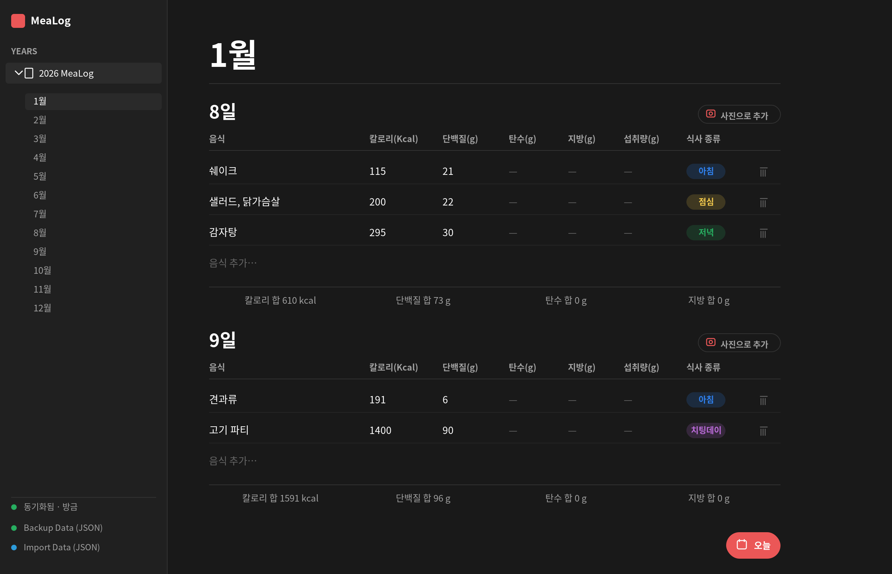

# 🍎 MeaLog

식단을 빠르게 기록하고 **칼로리·탄단지(탄수/단백질/지방)** 를 트래킹하는 개인용 PWA입니다.
노션처럼 생긴 다크 테마 피드에서 날짜별로 음식을 입력하고, 음식 **사진 한 장으로 AI가 영양 정보를 자동 추정**해 줍니다.



## 화면 설명

위 화면은 데스크톱에서의 메인 피드입니다.

- **왼쪽 사이드바** — 연도(2026 MeaLog) 아래로 1~12월을 펼쳐 원하는 달로 바로 이동합니다. 하단에는 동기화 상태와 데이터 백업/가져오기(JSON) 메뉴가 있습니다.
- **가운데 피드** — 선택한 달이 큰 제목으로 뜨고, 그 아래로 날짜별 블록이 이어집니다. 앱을 열면 오늘 날짜로 자동 스크롤됩니다.
- **날짜별 표** — 한 줄에 `음식 / 칼로리 / 단백질 / 탄수 / 지방 / 섭취량 / 식사 종류`를 인라인으로 입력합니다. 맨 아래 빈 줄(`음식 추가…`)에 입력하면 새 행이 바로 추가됩니다. 식사 종류는 아침·점심·저녁·간식·건강식·치팅데이로 색상 태그가 붙습니다.
- **합계 줄** — 그날의 칼로리/단백질/탄수/지방 합계를 자동 계산해 보여 줍니다. 칼로리를 비워 두고 탄단지만 넣으면 4·4·9 기준으로 환산값이 자동 반영됩니다.
- **사진으로 추가** — 음식 사진을 올리면 Gemini 비전 모델이 항목별 중량과 영양을 추정해 표에 채워 줍니다.
- **오늘 버튼** — 오른쪽 아래 버튼으로 언제든 오늘 날짜로 돌아옵니다.

## 주요 기능

- 날짜별 식단 인라인 입력과 일일 영양 합계 자동 계산
- 음식 사진 → AI 영양 분석(중량·칼로리·탄단지 추정)
- 오프라인 우선(IndexedDB, Dexie) + Supabase 클라우드 동기화
- JSON 백업/가져오기
- 설치형 PWA(모바일에서는 사이드바가 드로어로 전환)

## 기술 스택

React 19 · Vite 7 · Dexie(IndexedDB) · Supabase · vite-plugin-pwa · Google Gemini API · lucide-react

## AI 모델 (Gemini)

음식 사진 분석은 Google Gemini 비전 API를 클라이언트에서 직접 호출합니다.
기본 모델을 **`gemini-2.5-flash` → `gemini-3.1-flash-lite`** 로 변경했습니다.

이유는 두 가지입니다.

1. **무료 한도가 가장 넉넉한 등급** — Flash-Lite 등급은 같은 무료 티어에서도 Flash 대비 하루 요청 한도(RPD)가 훨씬 큽니다. 사진 분석은 가벼운 멀티모달 작업이라 Lite로도 충분합니다.
2. **더 저렴하고 빠름** — 유료로 넘어가도 토큰 단가가 Flash의 1/6 수준이고, 응답 지연도 더 짧습니다.

폴백 체인도 정리했습니다. 기존 폴백이던 `gemini-2.0-flash` / `gemini-1.5-flash` 는 **현재 종료(shut down)** 되어 제거하고, 살아 있는 모델로 교체했습니다.

```
gemini-3.1-flash-lite  →  gemini-2.5-flash-lite  →  gemini-2.5-flash
```

`.env` 의 `VITE_GEMINI_MODEL` 로 언제든 다른 모델을 지정할 수 있습니다.

### 모델 비교

| 모델 | 상태 | 멀티모달 입력 | 컨텍스트(입력/출력) | 유료 입력 / 출력 (1M 토큰) | 무료 티어 |
| --- | --- | --- | --- | --- | --- |
| **`gemini-3.1-flash-lite`** ⭐ 기본값 | Stable | 텍스트·이미지·동영상·오디오·PDF | 1,048,576 / 65,536 | **$0.25 / $1.50** | 무료 제공 · 일일 한도 가장 넉넉 |
| `gemini-2.5-flash-lite` | Stable | 텍스트·이미지·동영상·오디오 | 1,048,576 / 65,536 | $0.10 / $0.40 | 무료 제공 · 한도 넉넉 |
| `gemini-2.5-flash` (이전 기본값) | Stable | 텍스트·이미지·동영상·오디오 | 1,048,576 / 65,536 | $0.30 / $2.50 | 무료 제공 · 한도 작음 |
| ~~`gemini-2.0-flash`~~ | 종료됨 | — | — | — | 사용 불가 |
| ~~`gemini-1.5-flash`~~ | 종료됨 | — | — | — | 사용 불가 |

> 유료 단가는 Standard 등급, 텍스트/이미지/동영상 입력 기준입니다(오디오는 더 비쌈).
> 무료 티어의 정확한 일일 요청 수(RPD)는 Google이 계정·프로젝트별로 [AI Studio](https://aistudio.google.com/rate-limit)에서 표시하며 수시로 바뀝니다. 일반적으로 **Flash-Lite 등급 > Flash 등급** 순으로 무료 한도가 큽니다.
> 출처: [Gemini API 모델](https://ai.google.dev/gemini-api/docs/models) · [요금](https://ai.google.dev/gemini-api/docs/pricing) · [요청 한도](https://ai.google.dev/gemini-api/docs/rate-limits) (2026-06 기준)

## 시작하기

```bash
npm install

# 환경 변수 설정: .env.example 를 .env 로 복사한 뒤 값 채우기
cp .env.example .env

npm run dev      # 개발 서버
npm run build    # 프로덕션 빌드
npm run preview  # 빌드 결과 미리보기
```

### 환경 변수

| 변수 | 필수 | 설명 |
| --- | --- | --- |
| `VITE_GEMINI_API_KEY` | 사진 분석 사용 시 | [Google AI Studio](https://aistudio.google.com/apikey)에서 무료 발급. 미설정 시 '사진으로 추가'만 비활성화됩니다. |
| `VITE_GEMINI_MODEL` | 선택 | 사용할 모델. 기본값 `gemini-3.1-flash-lite`. |
| `VITE_SUPABASE_URL` | 동기화 사용 시 | 미설정 시 동기화 없이 로컬 전용으로 동작합니다. |
| `VITE_SUPABASE_ANON_KEY` | 동기화 사용 시 | Supabase 프로젝트의 anon 키. |

> API 키는 클라이언트에 노출됩니다(개인용 앱 기준). 공개 배포 시에는 서버 프록시로 옮기는 것을 권장합니다.

## 배포

`main` 브랜치에 push하면 GitHub Actions가 GitHub Pages로 자동 배포합니다.
저장소 **Settings → Secrets and variables → Actions** 에 `VITE_SUPABASE_URL`, `VITE_SUPABASE_ANON_KEY`(필요 시 `VITE_GEMINI_API_KEY`)를 등록하세요.

## 스크린샷 다시 만들기

README 이미지는 실제 UI 코드/테마를 그대로 옮겨 렌더한 것으로, 아래로 다시 생성할 수 있습니다.

```bash
pip install cairosvg
python scripts/gen_screenshot.py   # docs/screenshot.png 생성
```
